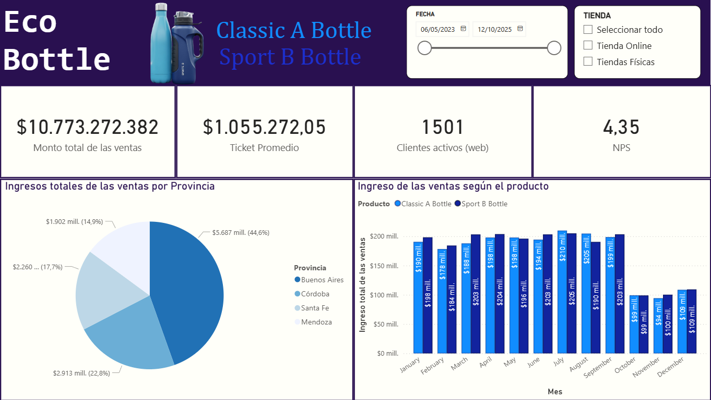
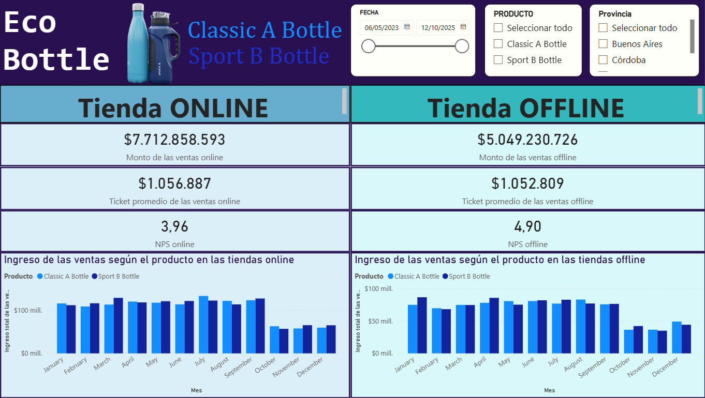
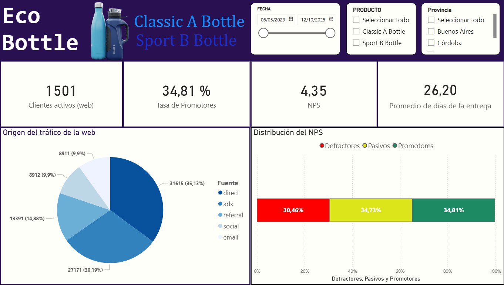
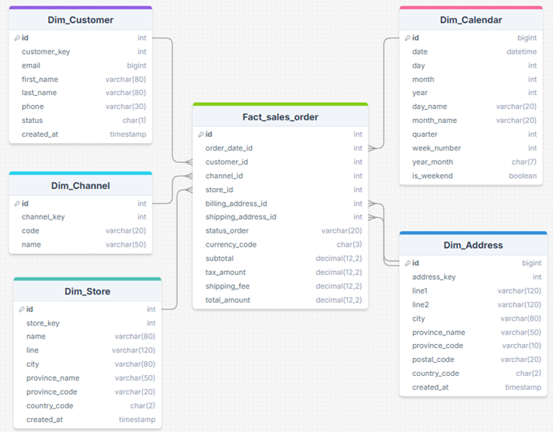
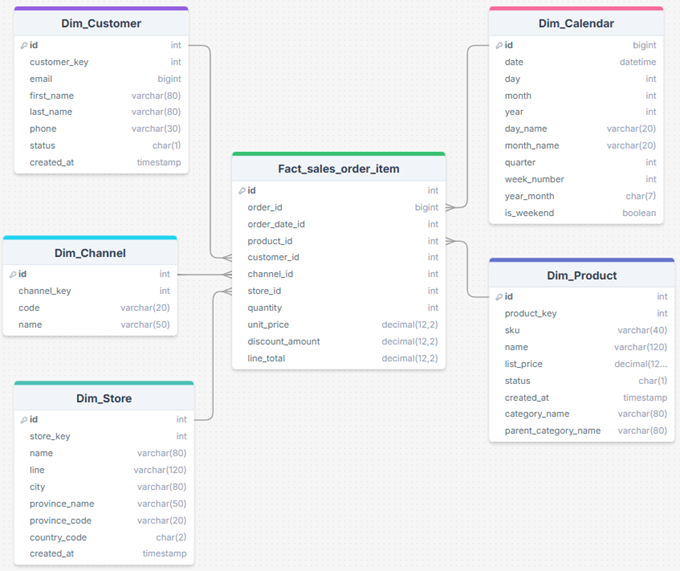
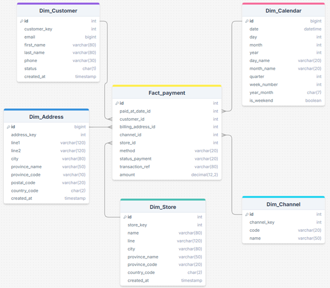
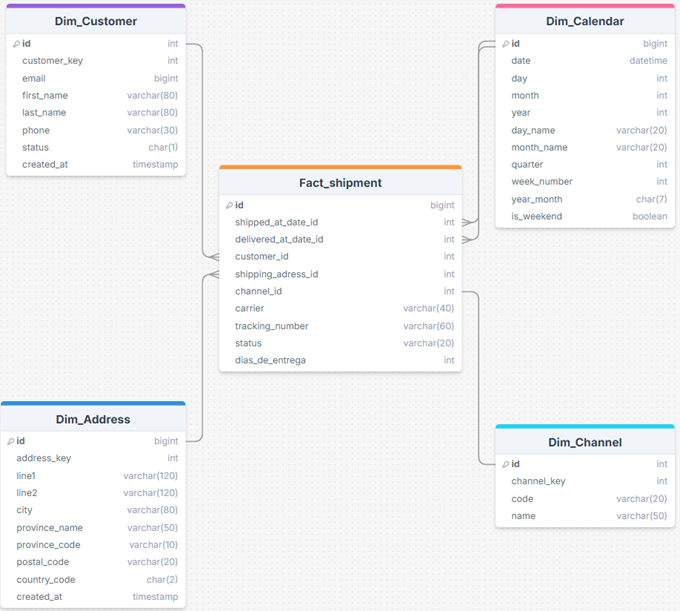
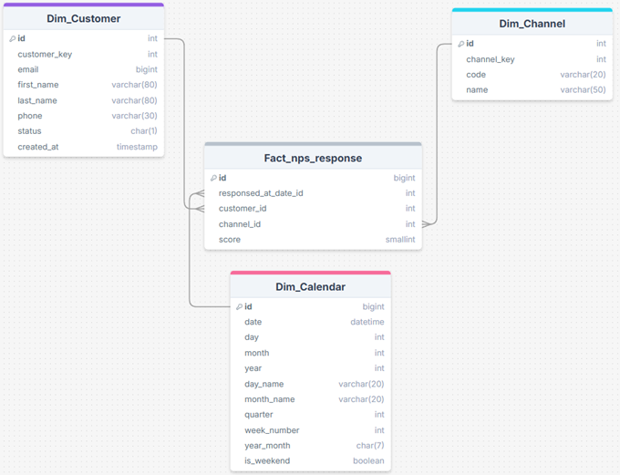
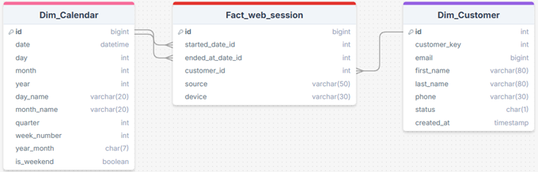

# Proyecto Final: Dashboard de Marketing y Negocios Digitales - EcoBottle

Este repositorio contiene el proyecto final para la materia "Introducción al Marketing Online y los Negocios Digitales". [cite_start]El objetivo es implementar un ecosistema de datos (ETL) y construir un dashboard de reporte comercial.

## 1. Dashboards (Resultados)

Los datos procesados se utilizaron para construir tres dashboards en Power BI, enfocados en el análisis comercial y la experiencia del cliente.

**[Ver Dashboard Interactivo]([https://app.powerbi.com/view?r=eyJrIjoiYmU3YjhjZWUtYjZlOC00M2EzLWI0MjMtYjgwMDYyMTE3ZWZhIiwidCI6IjNlMDUxM2Q2LTY4ZmEtNDE2ZS04ZGUxLTZjNWNkYzMxOWZmYSIsImMiOjR9])**

### Dashboard 1: Reporte Comercial



### Dashboard 2: Comparación Negocio ONLINE VS OFFLINE



### Dashboard 3: Tráfico web



---

## 2. Instrucciones de Ejecución

Este proyecto utiliza Python para el proceso de ETL (Extract, Transform, Load). Los datos en crudo (`RAW/`) se transforman en un Data Warehouse (`DW/`) listo para ser consumido por Power BI.

**Herramientas Utilizadas**

- **Python 3.10+**
- **Pandas:** Para toda la lógica de extracción, transformación y carga (ETL).
- **Git / GitHub:** Para control de versiones y gestión del proyecto.
- **Power BI:** Para la visualización y el dashboard de KPIs.

**Pasos para ejecutar el ETL de manera local:**

Sigue estos pasos para ejecutar el pipeline de transformación ETL en tu máquina:

1.  **Clonar el repositorio:**

    ```bash
    git clone [URL-DE-TU-REPOSITORIO-GIT]
    cd mkt_tp_final
    ```

2.  **Crear y activar un entorno virtual**:
    _(Usamos `venv` como definimos en nuestro proyecto)_

    ```bash
    # En Windows (cmd/powershell)
    python -m venv venv
    .\venv\Scripts\activate

    # En macOS/Linux
    python3 -m venv venv
    source venv/bin/activate
    ```

3.  **Instalar dependencias:**

    ```bash
    pip install -r requirements.txt
    ```

4.  **Ejecutar el pipeline de transformación:**
    El script `main.py` en la raíz del proyecto orquesta todo el proceso.

    ```bash
    python main.py
    ```

5.  **Verificar la salida:**
    Tras la ejecución, la carpeta `DW/` (Data Warehouse) deberá contener los 12 archivos `.CSV` transformados, listos para subir a Looker Studio.

[cite_start]Al finalizar, la carpeta `DW/` contendrá todos los archivos `.csv` limpios (`dim_customer.csv`, `fact_sales_order.csv`, etc.), listos para ser cargados en Power BI.

---

## 3. Modelo de Datos y Diccionario

El proyecto utiliza un **esquema estrella** donde las tablas de hechos (`fact_`) se conectan con las dimensiones (`dim_`) para permitir el análisis.

### Diagramas de Estrella

A continuación se presentan los diagramas de estrella para cada tabla de hechos:

**Diagrama de `fact_sales_order`:**


**Diagrama de `fact_sales_order_item`:**


**Diagrama de `fact_payment`:**


**Diagrama de `fact_shipment`:**


**Diagrama de `fact_nps_response`:**


**Diagrama de `fact_web_session`:**


### Diccionario de Datos

El Data Warehouse (`DW/`) se compone de 6 Dimensiones y 6 Tablas de Hechos.

#### Dimensiones (`DW/`)

Las dimensiones responden al **quién, qué, dónde y cuándo** del análisis.

- **1. dim_calendar**

  - **PK (Clave Primaria):** `id` (Tipo: `INT`)
  - **Atributos:**
    - `date` (Tipo: `DATE`) - Fecha completa (ej. '2025-01-01').
    - `day` (Tipo: `INT`) - Día del mes (1-31).
    - `month` (Tipo: `INT`) - Mes del año (1-12).
    - `year` (Tipo: `INT`) - Año (ej. 2025).
    - `day_name` (Tipo: `VARCHAR(20)`) - Nombre del día (ej. 'Wednesday').
    - `month_name` (Tipo: `VARCHAR(20)`) - Nombre del mes (ej. 'January').
    - `quarter` (Tipo: `INT`) - Trimestre del año (1-4).
    - `week_number` (Tipo: `INT`) - Número de semana del año.
    - `year_month` (Tipo: `CHAR(7)`) - Año y mes (ej. '2025-01').
    - `is_weekend` (Tipo: `BOOLEAN`) - Verdadero si es Sábado o Domingo.

- **2. dim_customer**

  - **PK (Clave Primaria):** `id` (Tipo: `INT`)
  - **Atributos:**
    - `customer_key` (Clave Natural) (Tipo: `INT`) - ID original del cliente.
    - `email` (Tipo: `VARCHAR(120)`) - Email único del cliente.
    - `first_name` (Tipo: `VARCHAR(80)`) - Nombre del cliente.
    - `last_name` (Tipo: `VARCHAR(80)`) - Apellido del cliente.
    - `phone` (Tipo: `VARCHAR(30)`) - Teléfono del cliente.
    - `status` (Tipo: `CHAR(1)`) - Estado ('A' = Activo, 'I' = Inactivo).
    - `created_at` (Tipo: `TIMESTAMP`) - Fecha de alta del cliente.

- **3. dim_product**

  - **PK (Clave Primaria):** `id` (Tipo: `INT`)
  - **Atributos:**
    - `product_key` (Clave Natural) (Tipo: `INT`) - ID original del producto.
    - `sku` (Tipo: `VARCHAR(40)`) - SKU único del producto.
    - `name` (Tipo: `VARCHAR(120)`) - Nombre del producto (ej. 'Classic A Bottle').
    - `list_price` (Tipo: `DECIMAL(12, 2)`) - Precio de lista.
    - `status` (Tipo: `CHAR(1)`) - Estado ('A' = Activo, 'I' = Inactivo).
    - `created_at` (Tipo: `TIMESTAMP`) - Fecha de creación del producto.
    - `category_name` (Tipo: `VARCHAR(80)`) - Nombre de la categoría del producto.
    - `parent_category_name` (Tipo: `VARCHAR(80)`) - Nombre de la categoría padre.

- **4. dim_address**

  - **PK (Clave Primaria):** `id` (Tipo: `INT`)
  - **Atributos:**
    - `address_key` (Clave Natural) (Tipo: `INT`) - ID original de la dirección.
    - `line1` (Tipo: `VARCHAR(120)`) - Línea 1 de la dirección.
    - `line2` (Tipo: `VARCHAR(120)`) - Línea 2 de la dirección.
    - `city` (Tipo: `VARCHAR(80)`) - Ciudad.
    - `province_name` (Tipo: `VARCHAR(50)`) - Nombre de la provincia.
    - `province_code` (Tipo: `VARCHAR(10)`) - Código de provincia.
    - `postal_code` (Tipo: `VARCHAR(20)`) - Código Postal.
    - `country_code` (Tipo: `CHAR(2)`) - Código de país.
    - `created_at` (Tipo: `TIMESTAMP`) - Fecha de creación de la dirección.

- **5. dim_store**

  - **PK (Clave Primaria):** `id` (Tipo: `INT`)
  - **Atributos:**
    - `store_key` (Clave Natural) (Tipo: `INT`) - ID original de la tienda.
    - `name` (Tipo: "VARCHAR(80)") - Nombre de la tienda.
    - `line` (Tipo: "VARCHAR(120)") - Dirección (Línea 1).
    - `city` (Tipo: `VARCHAR(80)`) - Ciudad.
    - `province_name` (Tipo: `VARCHAR(50)`) - Nombre de la provincia.
    - `province_code` (Tipo: `VARCHAR(10)`) - Código de provincia.
    - `postal_code` (Tipo: `VARCHAR(20)`) - Código Postal.
    - `country_code` (Tipo: `CHAR(2)`) - Código de país.
    - `created_at` (Tipo: `TIMESTAMP`) - Fecha de creación de la dirección.

- **6. dim_channel**
  - **PK (Clave Primaria):** `id` (Tipo: `INT`)
  - **Atributos:**
    - `channel_key` (Clave Natural) (Tipo: `INT`) - ID original del canal.
    - `code` (Tipo: `VARCHAR(20)`) - Código ('ONLINE', 'OFFLINE').
    - `name` (Tipo: `VARCHAR(50)`) - Nombre del canal (ej. 'Tienda Online').

---

#### Tablas de Hechos (`DW/`)

Las tablas de hechos contienen las **métricas** (indicadores) y las claves foráneas (FKs) que las conectan a las dimensiones.

- **1. fact_sales_order**

  - **PK (Clave Primaria):** `id` (Clave Natural) (Tipo: `BIGINT`)
  - **FK (Claves Foráneas):**
    - `order_date_id` (Tipo: `INT`) -> se une a `dim_calendar[id]`
    - `customer_id` (Tipo: `INT`) -> se une a `dim_customer[customer_key]`
    - `channel_id` (Tipo: `INT`) -> se une a `dim_channel[channel_key]`
    - `store_id` (Tipo: `INT`) -> se une a `dim_store[store_key]`
    - `billing_address_id` (Tipo: `INT`) -> se une a `dim_address[address_key]`
    - `shipping_address_id` (Tipo: `INT`) -> se une a `dim_address[address_key]`
  - **Atributos:**
    - `status_order` (Tipo: `VARCHAR(20)`) - Estado del pedido.
    - `currency_code` (Tipo: `CHAR(3)`) - Moneda.
  - **Métricas:**
    - `subtotal` (Tipo: `DECIMAL(12, 2)`) - Monto antes de impuestos.
    - `tax_amount` (Tipo: `DECIMAL(12, 2)`) - Monto de impuestos.
    - `shipping_fee` (Tipo: `DECIMAL(12, 2)`) - Costo de envío.
    - `total_amount` (Tipo: `DECIMAL(12, 2)`) - Monto total pagado.

- **2. fact_sales_order_item**

  - **PK (Clave Primaria):** `id` (Clave Natural) (Tipo: `BIGINT`)
  - **FK (Claves Foráneas):**
    - `order_id` (Tipo: `BIGINT`)
    - `order_date_id` (Tipo: `INT`) -> se une a `dim_calendar[id]`
    - `product_id` (Tipo: `INT`) -> se une a `dim_product[product_key]`
    - `customer_id` (Tipo: `INT`) -> se une a `dim_customer[customer_key]`
    - `channel_id` (Tipo: `INT`) -> se une a `dim_channel[channel_key]`
    - `store_id` (Tipo: `INT`) -> se une a `dim_store[store_key]`
  - **Métricas:**
    - `quantity` (Tipo: `INT`) - Cantidad de unidades vendidas.
    - `unit_price` (Tipo: `DECIMAL(12, 2)`) - Precio unitario.
    - `discount_amount` (Tipo: `DECIMAL(12, 2)`) - Monto de descuento.
    - `line_total` (Tipo: `DECIMAL(12, 2)`) - Total de la línea (qty\*price - disc).

- **3. fact_payment**

  - **PK (Clave Primaria):** `id` (Clave Natural) (Tipo: `BIGINT`)
  - **FK (Claves Foráneas):**
    - `paid_at_date_id` (Tipo: `INT`) -> se une a `dim_calendar[id]`
    - `customer_id` (Tipo: `INT`) -> se une a `dim_customer[customer_key]`
    - `billing_address_id` (Tipo: `INT`) -> se une a `dim_address[address_key]`
    - `channel_id` (Tipo: `INT`) -> se une a `dim_channel[channel_key]`
    - `store_id` (Tipo: `INT`) -> se une a `dim_store[store_key]`
  - **Atributos (Dimensiones Degeneradas):**
    - `method` (Tipo: `VARCHAR(20)`) - Método de pago.
    - `status_payment` (Tipo: `VARCHAR(20)`) - Estado del pago.
    - `transaction_ref` (Tipo: `VARCHAR(80)`) - Referencia de transacción.
  - **Métricas:**
    - `amount` (Tipo: `DECIMAL(12, 2)`) - Monto del pago.

- **4. fact_shipment**

  - **PK (Clave Primaria):** `id` (Clave Natural) (Tipo: `BIGINT`)
  - **FK (Claves Foráneas):**
    - `shipped_at_date_id` (Tipo: `INT`) -> se une a `dim_calendar[id]`
    - `delivered_at_date_id` (Tipo: `INT`) -> se une a `dim_calendar[id]`
    - `customer_id` (Tipo: `INT`) -> se une a `dim_customer[customer_key]`
    - `shipping_address_id` (Tipo: `INT`) -> se une a `dim_address[address_key]`
    - `channel_id` (Tipo: `INT`) -> se une a `dim_channel[channel_key]`
  - **Atributos:**
    - `carrier` (Tipo: `VARCHAR(40)`) - Transportista.
    - `tracking_number` (Tipo: `VARCHAR(60)`) - Nro. de seguimiento.
    - `status` (Tipo: `VARCHAR(20)`) - Estado del envío.
  - **Métricas:**
    - `dias_de_entrega` (Tipo: `INT`) - Días calculados (entrega - despacho).

- **5. fact_web_session**

  - **PK (Clave Primaria):** `id` (Clave Natural) (Tipo: `BIGINT`)
  - **FK (Claves Foráneas):**
    - `started_at_date_id` (Tipo: `INT`) -> se une a `dim_calendar[id]`
    - `ended_at_date_id` (Tipo: `INT`) -> se une a `dim_calendar[id]`
    - `customer_id` (Tipo: `INT`) -> se une a `dim_customer[customer_key]`
  - **Atributos:**
    - `source` (Tipo: `VARCHAR(50)`) - Fuente de tráfico ('ads', 'direct').
    - `device` (Tipo: `VARCHAR(30)`) - Dispositivo ('mobile', 'desktop').

- **6. fact_nps_response**
  - **PK (Clave Primaria):** `id` (Clave Natural) (Tipo: `BIGINT`)
  - **FK (Claves Foráneas):**
    - `responded_at_date_id` (Tipo: `INT`) -> se une a `dim_calendar[id]`
    - `customer_id` (Tipo: `INT`) -> se une a `dim_customer[customer_key]`
    - `channel_id` (Tipo: `INT`) -> se une a `dim_channel[channel_key]`
  - **Métricas:**
    - `score` (Tipo: `SMALLINT`) - Puntaje de 0 a 10.

---

## Arquitectura del Proyecto

El proyecto sigue una estructura ETL clásica, pero optimizada para este trabajo:

1.  **`raw/`**: Contiene los 13 archivos `.CSV` fuente que simulan la base de datos transaccional (OLTP) de EcoBottle.
2.  **`src/`**: Contiene toda la lógica de transformación del pipeline, separada en módulos:
    - **`src/extract.py`**: Función para leer los 13 CSVs desde la carpeta `raw/`.
    - **`src/transform.py`**: Contiene toda la lógica para limpiar, desnormalizar y construir cada una de las 6 tablas de Dimensión y 6 de Hechos.
    - **`src/load.py`**: Función para guardar los 12 DataFrames transformados en el directorio `DW/`.
    - **`src/__init__.py`**: Permite que `src/` sea tratado como un paquete de Python.
3.  **`DW/`**: Es el Data Warehouse (Data Mart) de salida. Los 12 archivos `.CSV` en esta carpeta están limpios, modelados y listos para ser consumidos por Power BI.
4.  **`main.py`**: El script orquestador que llama a las funciones de `extract`, `transform` y `load` en el orden correcto para ejecutar el pipeline completo.
5.  **`requirements.txt`**: Define las dependencias de Python (ej. `pandas`) necesarias para correr el proyecto.

---

---

## 4. Consultas Clave (Medidas DAX)

Para calcular los KPIs solicitados y utilizados en las visualizaciones, se utilizaron las siguientes medidas DAX en Power BI creadas en la tabla de Medidas:

```dax
--------------------------------------------------
-- KPIs Principales
--------------------------------------------------

Ticket Promedio =
DIVIDE(
    CALCULATE(
        SUM(fact_sales_order[total_amount]),
        fact_sales_order[status_order] IN { "PAID", "FULFILLED" }
    ),
    CALCULATE(
        COUNTROWS(fact_sales_order),
        fact_sales_order[status_order] IN { "PAID", "FULFILLED" }
    )
)

Ventas Totales (Filtradas por Producto) =
CALCULATE(
    SUM(fact_sales_order[total_amount]),
    fact_sales_order_item
)

--------------------------------------------------
-- Medidas de NPS
--------------------------------------------------

NPS =
VAR Promoters =
    COUNTROWS(
        FILTER(
            fact_nps_response,
            fact_nps_response[score] >= 9
        )
    )
VAR Detractors =
    COUNTROWS(
        FILTER(
            fact_nps_response,
            fact_nps_response[score] <= 6
        )
    )
VAR TotalResponses =
    COUNTROWS(fact_nps_response)

RETURN
IF(
    TotalResponses > 0,
    ( ( Promoters - Detractors ) / TotalResponses ) * 100
)

Tasa de Promotores =
DIVIDE(
    CALCULATE(
        COUNTROWS(fact_nps_response),
        fact_nps_response[score] >= 9
    ),
    COUNTROWS(fact_nps_response)
)

Promotores =
CALCULATE(
    COUNTROWS(fact_nps_response),
    fact_nps_response[score] >= 9
)

Pasivos =
CALCULATE(
    COUNTROWS(fact_nps_response),
    fact_nps_response[score] >= 7 && fact_nps_response[score] <= 8
)

Detractores =
CALCULATE(
    COUNTROWS(fact_nps_response),
    fact_nps_response[score] <= 6
)
```
